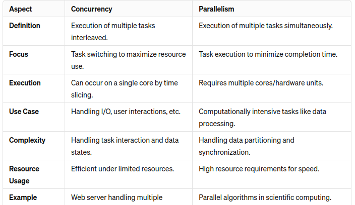

# tokka-transaction-challenge

This project involves developing a backend system to determine the transaction fee in USDT for all Uniswap WETH-USDC transactions.


## Summary
- [1/ Installation](#1-installation)
    - [Prerequisites](#prerequisites)
    - [Setup](#setup)
- [2/ Usage](#2-usage)
    - [A/ Postgres Admin Page](#a-postgres-admin-page)
    - [B/ Check Swagger API](#b-check-swagger-api)
    - [C/ Realtime Data Record](#c-realtime-data-record)
    - [D/ Batch Data Record](#d-batch-data-record)
    - [E/ Testing](#e-testing)
- [3/ System Design & Technology Choices](#3-system-design--technology-choices)
    - [A/ Database](#a-database)
    - [B/ Concurrency vs Parallelism](#b-concurrency-vs-parallelism)
    - [C/ Network](#c-network)
    - [D/ Availability](#d-availability)
    - [E/ Scalability](#e-scalability)
    - [F/ Reliability](#f-reliability)

## 1/ Installation

### Prerequisites
Before setting up the project, ensure you have the following software installed:
- **Docker**: Download and install Docker Desktop from [Docker's official website](https://www.docker.com/products/docker-desktop).
- **docker-compose**: Follow the installation guide available at [Docker Compose](https://docs.docker.com/compose/install/).
- **Python 3**: Install Python 3 by following the instructions on the [official Python website](https://www.python.org/downloads/).

### Setup
Follow these steps to set up the project environment:
1. Clone the project repository:
   ```bash
   git clone -b main https://github.com/tukhai/tokka-transaction-fee.git
   ```
2. Copy the provided `.env` file into the root directory of the project, ensuring it is at the same level as the `.env.example `file. This `.env` file should be sent to you via **EMAIL**.
3. Start the system
    ```bash
   docker-compose up
   ```
- This command will:
    - Build 1 Docker image for the Python Django application.
    - Pull 2 Docker images: one for PgAdmin and another for TimescaleDB.
    - Create a total of 6 containers: backend app, realtime service, batch service, test service, PgAdmin, and TimescaleDB.

## 2/ Usage

### A/ Postgres Admin Page
- Navigate to pgAdmin page http://localhost:5050/browser/
- Login with credential in **EMAIL**
```
PGADMIN_DEFAULT_EMAIL=
PGADMIN_DEFAULT_PASSWORD=
```
- Right click on `Servers` to Registeter - Server the connection
    - General > Name: could be anything
    - Connection: (You can find all of these credentials inside `.env` from **EMAIL**)
    ```
    HOST=localhost # Host name/address
    PORT=5432 # Port
    DATABASE_NAME=postgres # Maintenance database
    DATABASE_USER=postgres # Username
    DATABASE_PASSWORD= # Password
    ```
- After connected, you can start to query SQL with `Query Tool`, a feature of pgAdmin.

### B/ Check Swagger API
- Navigate to Swagger API Playground http://localhost:8000/swagger/
    - No need to login / authenticate to this page.
    - There're 4 APIs with detailed descriptions, usage, example (can copy example params & run, it'll work).

- Navigate to Swagger Documents page http://localhost:8000/redoc/
    - On this webpage, info of the 4 APIs is shown straight away, but no need to click around.

### C/ Realtime Data Record
- When system start at `docker-compose up`, `realtime_service` is also up & starts to capture realtime data
- User can query to see the realtime data being inserted:
```SQL
select * from transaction_record
```
- Etherscan free account owner can go to the website to see statistics of API calls of the API_KEY token. Each API token (max 3 for free account) has its own statistics:

This image shows that our system is able to utilise API Rate limit of 300 calls per min (5 per second) to ensure data from Etherscan is captured with lowest latency. With concurency, system is able to call 250 APIs in 1min.


### D/ Batch Data Record
- From a separate terminal, user can run this command to record batch data for any given period of time
```bash
docker-compose run --rm batch_service python manage.py batch_record 1704105600 1706784000
```
For this command, the start time is `1704105600` (Jan-01-2024) & end time is `1706784000` (Feb-01-2024)
- With concurency being optimized, the system is able to:
    - batch 1 month of data (200,000 records) in around **2min**
    - batch 1 year if data (2,500,000 records) in around **15min**
- Etherscan free account owner can go to the website to see statistics of API calls of the API_KEY_BATCH token. Each API token (max 3 for free account) has its own statistics:

This image shows that our system is able to utilise API Rate limit of 300 calls per min (5 per second) to ensure data from Etherscan is captured with lowest latency. With concurency, system is able to call 150 APIs in 1min.

### E/ Testing
- From a separate terminal, user can run this command to run all unit tests and API integration tests on the app (related to `get_transaction_by_hash` and `get_swap_price` only).
```bash
docker-compose run --rm django_test python manage.py test
```
- To test the latency & accuracy of `Realtime Data Recording` and `Batch Data Recording`, user can use 2 API: `compare_realtime_data` and `compare_batch_data`.

## 3/ System Design & Technology Choices

### A/ Database
- When it comes to time-series data, the 2 most popular optimized options are TimescaleDB and InfluxDB

- For our system:
    - Back envelop calculation: 1 transaction per 3 second on average => 1 year is 10,000,000 transactions
    - since the throughput is not high, frequency not high (5 APIs call per seconds rate limit) & total data size is small, Postgres or TimescaleDB should be sufficient
    - I chose TimescaleDB for the ease of partitioning on secondary index `hash`, so that we can query txn by `hash` more effectively
    - We not really take advantage on the horizontal scaling feature & auto data retention feature yet, but it's a future proof & make the system more **SCALABLE**.

### B/ Concurrency vs Parallelism
- Our main task is to call multiple APIs in the shortest time as possible.

- API call is limited by I/O, meaning the system is just waiting but does not overload. Therefore, concurency would be useful in optimizing realtime recording & batch recording; while Parallelism with multi-cores will not help much.
- Regarding the task to decode transaction & save executed price for billions of transactions, it's a calculation heavy task which is bound by no.of CPUs & therefore, we can optimize it with Parallelism:
    - `python multiprocess` is not as scalable as `message queue`, because we need to handle workload balance by ourself
    - amongst the `message queue`, `RabbitMQ` could be the most optimal choice:
        - 10 millions messages annual is still handlable by RabbitMQ. Even if it's scale up 2-3 times, it's still OK. Therefore, using Kafka would be over-complicated
        - RabbitMQ is also more suitable than Redis as `message queue` for our use case because it can retains message to disk during down event.
    - since the calculation is slow, we dont need to do in realtime => can do this as BATCH

### C/ Network
- Compared to running the system without Docker, docker-compose with brdige network is:
    - 12% slower for batch data recording of 1 month & more latency for realtime recording
- We can system performance by using host network (only works on Linux, installing Docker Engine only, but not Docker Desktop)
- Even for production deployment, we can still use host network to maximize performance.

### D/ Availability
- As we're currently partition by time, if 1 server is down, user might not be able to get transaction by the hash inside the down server.
- We can prevent this by having multiple replica for each server
- We can further reduce the cost of data storage / replica by creating multiple tier of data:
    - tier 1 (hot data, within 1 week): stored in TimescaleDB
    - tier 2 (about few months): compressed by TimescaleDB
    - tier 3 (more than 1 year): move data into a cheaper cold storage like S3

### E/ Scalability
- With features of TimescaleDB such as partition, clustering, auto data retention & RabbitMQ, the current system can still handle, even if the data size / data throughput is double or triple.

### F/ Reliability
- The system is highly reliable because when we scale & partition into multiple nodes / servers, if some server failed, the other can still keep calling APIs. Latency might be affected, but it's hard for the whole system to failed.
- Even, in case of failed API call, the system will keep retry. Latency may increase, but chance of failure is low.
